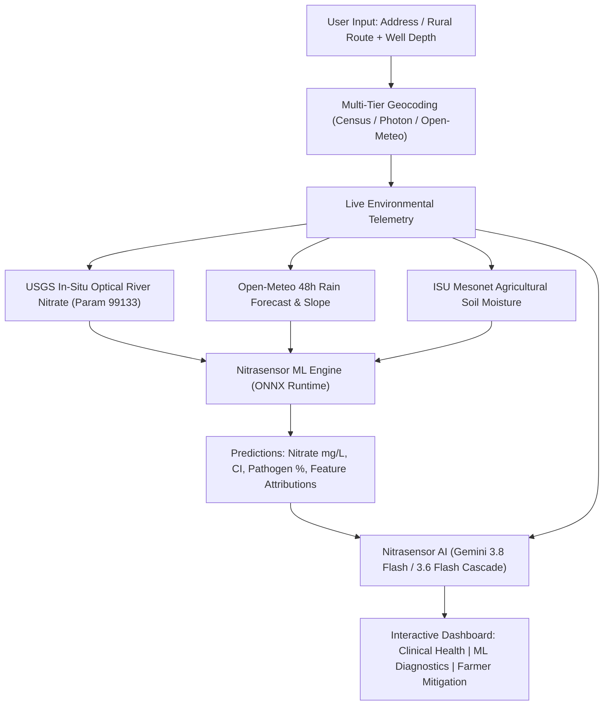

# Nitrasensor
**Rural Well-Water Safety and Runoff Predictor**

> *Over 300,000 rural Iowans drink from unregulated private wells. Nitrasensor combines real-time physical hydrology, an ONNX machine learning model, and Google Gemini AI to predict acute nitrate spikes and manure pathogen contamination before water is consumed.*

---

## Problem Overview

In the United States, municipal city tap water is strictly regulated and continuously monitored under the EPA Safe Drinking Water Act. **Private drinking wells are not.**

In agricultural states like Iowa:
- **Over 300,000 rural residents** rely entirely on private wells for drinking, cooking, and infant formula.
- Intensive row-crop corn and soybean agriculture and concentrated animal feeding operations (CAFOs) apply millions of tons of synthetic nitrogen fertilizer and liquid swine manure annually.
- **The Dual-Threat Contamination**:
  1. **Chemical Nitrates ($\text{NO}_3\text{-N}$)**: Soluble ions leach rapidly through topsoil into shallow unconfined aquifers. In infants under 6 months, nitrates convert into nitrites in the gut, binding to hemoglobin and causing life-threatening **Methemoglobinemia ("Blue Baby Syndrome")**.
  2. **Microbial Pathogens (*E. coli* and *Salmonella*)**: Heavy rainfall pushes livestock manure into fractured well casings and macropores, triggering acute bacterial gastroenteritis and severe dehydration.
- **The "Boiling Water Trap"**: When rural residents suspect water contamination, their natural instinct is to boil it. While boiling kills bacteria, it evaporates water and **concentrates dissolved chemical nitrates**, drastically increasing chemical toxicity.

Nitrasensor provides rural families and farmers with a predictive early warning system that bridges the critical gap between annual laboratory water tests.

---

## Key Features

### 1. Real-Time Environmental Sensing Telemetry
- **Continuous USGS River Nitrate Gauges**: Connects directly to the USGS National Water Information System (NWIS) optical sensor network (parameter `99133`) and dynamically pairs the user's well with the closest active river sensor across Iowa watersheds.
- **Forward Precipitation Forecast**: Ingests live 48-hour precipitation accumulation, rain probability, and soil moisture from Open-Meteo to model incoming runoff events before they reach the wellhead.
- **ISU Agronomy Mesonet (ISUSM)**: Integrates real-time automated soil moisture data (12" and 24" depths) from Iowa State University research stations.
- **Topographic Slope and Elevation**: Computes surface terrain gradient using digital elevation differentials.
- **Multi-Tier Rural Geocoding**: Cascades across US Census Geocoder, Photon Komoot (optimized for rural route addresses and county gravel roads like `3003 330th St`), and Open-Meteo.

### 2. Nitrasensor ML (ONNX Machine Learning Engine)
- **Calibrated on 13,000+ Real Iowa Well Tests**: Trained on historical laboratory water-well test records and well depths from the USGS/EPA Water Quality Portal (WQP).
- **Embedded ONNX Runtime**: Evaluates a `GradientBoostingRegressor` directly in Node.js via `onnxruntime-node`.
- **Outputs**:
  - Continuous predicted nitrate concentration ($\text{mg/L}$) against the 10.0 mg/L EPA Maximum Contaminant Level (MCL).
  - 90% Confidence Interval range.
  - Microbial pathogen (*E. coli* / *Salmonella*) co-transport infiltration probability (%).
  - Dynamic feature attributions showing the exact percentage impact and direction (+ / -) of each environmental factor.

### 3. Nitrasensor AI Clinical Assessment
- **Clinical Environmental Toxicologist Persona**: Powered by Google Gemini 3.8 Flash (with an automatic cascade to Gemini 3.6 Flash for high availability).
- **Context-Aware Hydrogeology**: Synthesizes the exact geological setting (e.g. Northeast Iowa Paleozoic Karst limestone, Des Moines Lobe tile drainage plains, or alluvial river corridors), well depth vulnerability, and storm dynamics into plain-language medical guidance.
- **Actionable Directives**: Clear infant formula preparation warnings, certified bottled water advisories, and the non-boiling safety protocol.

### 4. Farmer and Landowner Mitigation
- **48-Hour Manure Application Windows**: Real-time status indicating whether it is safe to apply liquid swine slurry or if fields should be held due to saturation and storm risk.
- **Wellhead Setback Buffers**: Recommended vegetated buffer zones (100-200 ft) and best management practices (BMPs) including cover crops and grassed waterways.

---

## System Architecture



---

## Tech Stack

- **Framework**: [Next.js 16](https://nextjs.org/) (App Router, Server Components and Route Handlers)
- **UI and Styling**: [React 19](https://react.dev/), [Tailwind CSS](https://tailwindcss.com/), [Lucide React Icons](https://lucide.dev/)
- **Machine Learning**: [Scikit-Learn](https://scikit-learn.org/), [ONNX Runtime Node](https://onnxruntime.ai/) (`onnxruntime-node`)
- **Artificial Intelligence**: [Google Gen AI SDK](https://github.com/google-gemini/deprecations) (`@google/genai`) using Gemini 3.8 Flash and 3.6 Flash
- **External Data Providers**:
  - USGS Water Services NWIS API
  - Iowa State University (ISU) Agronomy Mesonet API
  - Open-Meteo Forecast and Elevation APIs
  - US Census Geocoding API and Photon Komoot Geocoder

---

## Getting Started

### Prerequisites
- [Node.js](https://nodejs.org/) v18 or newer
- [npm](https://www.npmjs.com/)
- A Google Gemini API Key ([Google AI Studio](https://aistudio.google.com/))

### Installation

1. **Clone the repository:**
   ```bash
   git clone https://github.com/your-username/hophacks2026.git
   cd hophacks2026
   ```

2. **Install dependencies:**
   ```bash
   npm install
   ```

3. **Configure environment variables:**
   Create a `.env.local` file in the root directory:
   ```env
   GEMINI_API_KEY=your_gemini_api_key_here
   ```

4. **Run the development server:**
   ```bash
   npm run dev
   ```
   Open [http://localhost:3000](http://localhost:3000) in your browser.

5. **Build for production:**
   ```bash
   npm run build
   npm start
   ```

---

## Retraining the Machine Learning Model (Optional)

The machine learning model (`public/nitrate_model.onnx`) is trained directly on USGS/EPA Water Quality Portal data using `train.py`:

```bash
# Setup Python virtual environment
python3 -m venv .venv
source .venv/bin/activate

# Install requirements
pip install scikit-learn skl2onnx numpy onnxruntime

# Run training pipeline
python train.py
```
The script downloads Iowa well records, trains a `GradientBoostingRegressor`, computes evaluation metrics ($R^2$, $RMSE$, $MAE$), and exports the serialized model directly to `public/nitrate_model.onnx`.

---

## Disclaimer

Nitrasensor is an informational screening and predictive educational tool designed for private well owners and agricultural communities. It does not replace certified laboratory chemical and microbiological water analysis. Rural well owners are encouraged to test their water annually through their local county health department or the Iowa DNR Grants-to-Counties program.
